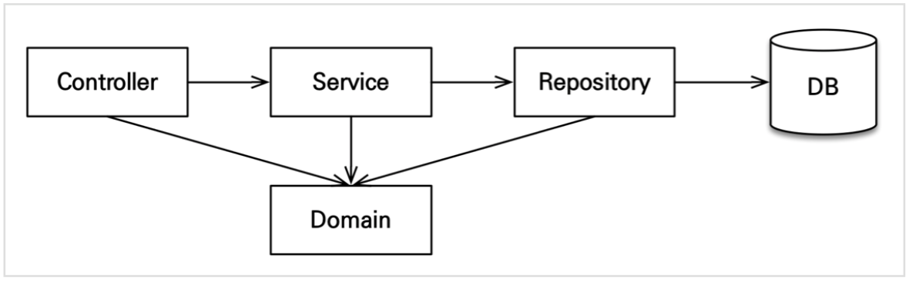

# 실전! 스프링 부트와 JPA 활용1 - 웹 애플리케이션 개발

- SpringBoot 2.4.2
- JDK 11
- DB H2 1.4.200
    - http://www.h2database.com/html/download.html

## 1. 프로젝트 환경설정

- 데이터베이스 파일 생성 방법
    - `jdbc:h2:~/jpashop` (최소 한번)
    - `~/jpashop.mv.db` 파일 생성 확인
    - 이후 부터는 `jdbc:h2:tcp://localhost/~/jpashop` 이렇게 접속

## 2. 도메인 분석 설계

### 기능 목록
- 회원 기능
  - 회원 등록
  - 회원 조회
- 상품 기능
  - 상품 등록
  - 상품 수정
  - 상품 조회
- 주문 기능
  - 상품 주문
  - 주문 내역 조회
  - 주문 취소
- 기타 요구사항
  - 상품은 재고 관리가 필요하다
  - 상품의 종류는 도서, 음반, 영화가 있다
  - 상품을 카테고리로 구분할 수 있다
  - 상품 주문시 배송 정보를 입력할 수 있다
  
## 3. 애플리케이션 구현 준비

### 구현 요구사항

- 회원 기능
  - 회원 등록
  - 회원 조회
- 상품 기능
  - 상품 등록
  - 상품 수정
  - 상품 조회
- 주문 기능
  - 상품 주문
  - 주문 내역 조회
  - 주문 취소

### 예제를 단순화 하기 위해 다음 기능은 구현X

- 로그인과 권한 관리X
- 파라미터 검증과 예외 처리X
- 상품은 도서만 사용
- 카테고리는 사용X 배송 정보는 사용X

### 계층형 구조 사용

- controller, web: 웹 계층
- service: 비즈니스 로직, 트랜잭션 처리
- repository: JPA를 직접 사용하는 계층, 엔티티 매니저 사용
- domain: 엔티티가 모여 있는 계층, 모든 계층에서 사용

### 패키지 구조

- jpabook.jpashop
  - domain
  - exception
  - repository
  - service
  - web

**개발 순서: 서비스, 리포지토리 계층을 개발하고, 테스트 케이스를 작성해서 검증, 마지막에 웹 계층 적용**

## 4. 회원 도메인 개발

### 구현 기능

- 회원 등록
- 회원 목록 조회

### 순서

- 회원 엔티티 코드 다시 보기
- 회원 리포지토리 개발
- 회원 서비스 개발
- 회원 기능 테스트

## 5. 상품 도메인 개발

### 구현 기능

- 상품 등록 
- 상품 목록 조회
- 상품 수정

### 순서

- 상품 엔티티 개발(비즈니스 로직 추가)
- 상품 리포지토리 개발
- 상품 서비스 개발
- 상품 기능 테스트

## 6. 주문 도메인 개발

### 구현 기능

- 상품 주문
- 주문 내역 조회
- 주문 취소

### 순서

- 주문 엔티티, 주문상품 엔티티 개발
- 주문 리포지토리 개발
- 주문 서비스 개발
- 주문 검색 기능 개발
- 주문 기능 테스트

## 7. 웹 계층 개발

- 홈 화면
- 회원 기능
  - 회원 등록
  - 회원 조회
- 상품 기능
  - 상품 등록
  - 상품 수정
  - 상품 조회
- 주문 기능
  - 상품 주문
  - 주문 내역 조회
  - 주문 취소

## 엔티티를 변경할 때는 항상 변경 감지를 사용하세요

- 컨트롤러에서 어설프게 엔티티를 생성하지 마세요
- 트랜잭션이 있는 서비스 계층에 식별자( id )와 변경할 데이터를 명확하게 전달하세요.(파라미터 or dto)
- 트랜잭션이 있는 서비스 계층에서 영속 상태의 엔티티를 조회하고, 엔티티의 데이터를 직접 변경하세요
- 트랜잭션 커밋 시점에 변경 감지가 실행됩니다